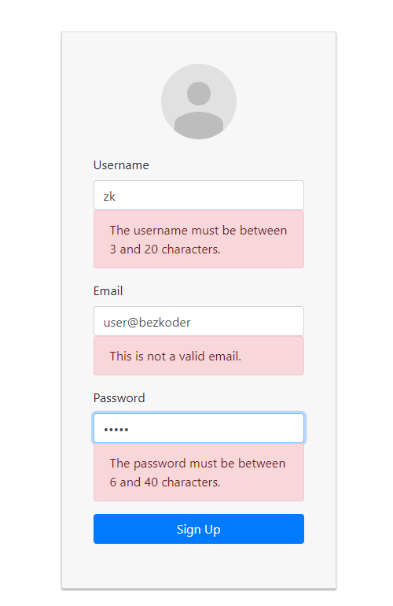

# React Typescript Authentication example with Hooks, Axios and Rest API

Build React Typescript Authentication and Authorization example using React Hooks, React Router, Axios and Bootstrap (without Redux):
- JWT Authentication Flow for User Signup & User Login
- Project Structure for React Typescript Authentication (without Redux) with React Router & Axios
- Creating React Components with Form Validation using Formik and Yup
- React Typescript Components for accessing protected Resources (Authorization)
- Dynamic Navigation Bar in React Typescript App

For instruction, please visit:
> [React Typescript Authentication example with Hooks, Axios and Rest API](https://www.bezkoder.com/react-typescript-authentication-example/)

Signup Page:

Form Validation:

Login Page:

Profile Page:

